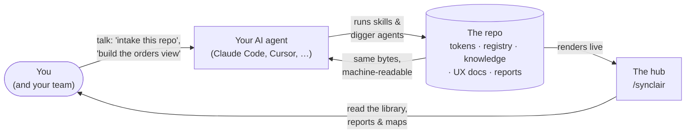

# Synclair

[](https://www.npmjs.com/package/synclair)
[](LICENSE)

**A project foundation you clone, not a package you install — built for teams
that build with AI.** Synclair gives a project one aligned source of truth —
design tokens, components, views, and distilled product knowledge — served by
an in-repo hub that humans browse and agents load. <https://synclair.dev>

```
npx synclair new my-project
cd my-project
npm install && npm run dev    # hub at http://localhost:4100/synclair
```

## The problem

Agent-built codebases drift. Every new session (and every new teammate) starts
blank: it reinvents components that already exist, restyles as it goes, and
ships views nobody documented. Meanwhile the humans lose sight of what the AI
actually built. The gap isn't talent — it's context. Everyone has the
information *somewhere*; nobody shares one surface.

Synclair closes that gap by making the repo itself the shared surface. Every
fact lives once — a token, a component's API, a spec digest, a system map —
and is projected two ways: **a page a person browses, and a machine-readable
form an agent loads.** Same bytes, so they can't drift apart.

## How it works — your AI is the engine

Synclair doesn't run anything by itself. It sits **in (or beside) your repo**
and turns your coding agent — Claude Code, Cursor, Codex, any agent that reads
`AGENTS.md` — into the engine. You talk to the agent; Synclair supplies what it
needs to act well: **skills** (packaged know-how for intakes, building views,
reports), **knowledge** (distilled specs, the system map, the component
catalog), and **guardrails** (machine checks that keep the output honest). The
hub renders whatever the agents produce, so humans can read it and steer.



It's a flywheel: **diggers** explore first — they read the code, the PRDs and
the Figma files and seed the hub so it starts full, not blank. From then on,
whatever you build documents itself into the shared surface as it's built, so
the next thing starts from everything before it. Nobody stops to write docs.

A concrete session looks like this:

> **You:** "Populate Synclair from this codebase."
> **Agent:** runs the `existing-project-intake` skill — a crew of digger
> subagents surveys the repo, harvests its docs, extracts its design tokens,
> and catalogs every component. The hub fills up: `/synclair/components` shows
> the real design system, `/synclair/system` maps the backend, `/synclair/knowledge`
> holds the distilled specs.
>
> **You:** "How's the build looking? What should we do next?"
> **Agent:** runs `build-report` — a data-verified read of what's there and a
> ranked list of recommendations, rendered at `/synclair/reports`.
>
> **You:** *(read the report, pick a recommendation)* "Do #2 — extract the
> table into the library."
> **Agent:** runs `component-library` — builds it on the tokens, registers it,
> writes its UX docs, and the machine checks verify it renders before it can
> be called done.

## Who it's for

- **Teams building with agents** who want velocity *without* a Frankenstein
  codebase — the guardrails make the fast path and the consistent path the
  same path.
- **Teams inheriting or auditing an existing app** — one intake command turns
  an unfamiliar codebase into a browsable library, system map, and hygiene
  report (this is Synclair's companion mode; the host repo is never touched).
- **Agencies & prototypers** who start projects constantly and want every
  clone to begin with a working design system, doc system, and agent crew.
- **Stakeholders** who want to see what's being built — live components and
  plain-English reports — without reading code.

## Get started

Three topologies, one foundation ([`docs/setup-modes.md`](docs/setup-modes.md)):

| You have… | Do this | Guide |
|---|---|---|
| **Nothing yet** — new project | `npx synclair new my-project` — the clone *is* the repo; your product grows at `/`, the hub lives at `/synclair` | [`docs/new-project.md`](docs/new-project.md) |
| **An existing app**, keep repos separate | `npx synclair new my-app-synclair` as a **sibling** directory — Synclair observes and documents the host, on its own server (port 4100), nothing lands in your repo | [`docs/existing-project.md`](docs/existing-project.md) |
| **An existing repo**, one-repo team | Embed it at `./synclair` via git subtree so the whole team (and their agents) get it by cloning | `co-locate-synclair` skill in the clone |

Then open your agent **in the clone** and say what you want:

- `"Run me through setup"` → the interview + reseed flow (brand, knowledge sources, identity)
- `"Populate Synclair from the codebase"` → the intake (existing-app modes)
- `"Build the <name> view"` → requirement-first building on the design system
- `"How's the build looking?"` → the report, then act on its recommendations

Claude Code picks the right skill automatically; other agents read the same
playbook via [`AGENTS.md`](AGENTS.md) — it's plain markdown, agent-neutral.

## What's in the hub

Everything renders at `/synclair` (your product lives at `/`):

| Route | What it is |
|---|---|
| `/synclair` | Overview — live counts, what changed |
| `/synclair/foundations` | Design tokens, rendered live from the theme — the style guide that can't go stale |
| `/synclair/components` · `/blocks` · `/templates` | The component library: every registered item renders **live** with UX docs (intent, anatomy, interactions, responsive) |
| `/synclair/knowledge` | Sources of truth (specs / PRDs / Figma / decks) + distilled summaries per audience |
| `/synclair/system` | The system map — areas, APIs, data model, jobs; what the codebase is beyond the UI |
| `/synclair/reports` | Build reports — plain-English state of the build + ranked next steps |
| `/synclair/hygiene` | Where the code steps outside its own design system (inline styles, raw colors) |
| `/synclair/ai-setup` | The agent crew and skills that ship with the clone, read live from `.claude/` |
| `/synclair/references` | The project's research library — prior art, findings, recommendations |
| `/synclair/environment` | Stack, services, and foundation freshness (call-home) |

Storage is **git** — Synclair is multiplayer without a server. Each person runs
the hub from the clone; the repo is the shared database; sync is `git pull`.

## The guardrails

What keeps agent output honest is machine-enforced, not aspirational
(`npm run verify-ui` — required before any UI work is "done"):

- **Tokens only** — raw hex and arbitrary px values are lint errors; the theme
  is the single source of styling truth.
- **Registration** — a component that isn't in the registry doesn't exist for
  reuse, so registration happens at creation. The registry is shadcn-format:
  your components are installable with the stock shadcn CLI.
- **Render coverage** — every library item must actually render in the hub
  (live import, preview scene, or embedded route). A doc page that only shows
  a code snippet is a claim the browser can't back up, and it fails the build.
- **UX-doc depth by tier** — stable blocks and templates require intent,
  interactions, states, and responsive docs, commit-anchored to the source
  they document so drift is flagged.

## Under the hood

[`docs/foundation-model.md`](docs/foundation-model.md) is the spec. The short version:

- **Brain** (portable): the token vocabulary, tier system, docs contract,
  search, knowledge layer — `lib/system/*`, `.claude/`.
- **Seed** (yours, never syncs): brand, identity, domain knowledge, project
  data. Blanked by `scripts/synclair-reset.sh`, filled per project.
- **Adapter** (swappable): how previews render and tokens export. The hub UI
  is always Next + shadcn; what it *governs* can be a web app or (via
  react-native-web) React Native.

## Staying current — updates are opt-in

Like shadcn, the source transfers to you: nothing phones home, nothing
auto-updates. When you *want* updates from this repo:

- `npm run call-home` — opt-in freshness check: is your foundation behind,
  and what's incoming? Also surfaced on `/synclair/environment`.
- The `synclair-sync` skill — pulls foundation updates as a deliberate git
  merge. Your seed never syncs, in either direction.

## FAQ

**Is Synclair part of my app?** No. It's a separate Next app on its own server
(port 4100). In companion mode it never adds a route, dependency, or build
step to your product.

**Does my team need to run AI to benefit?** The hub is useful to a human with
zero AI — a live style guide, component library, and system map. But the
flywheel (intakes, self-documenting builds, reports) is agent-driven.

**Which agents work with it?** Claude Code gets the deepest integration
(skills auto-surface, digger subagents). Anything that reads `AGENTS.md` —
Cursor, Codex, Copilot, Gemini, Aider — follows the same playbook manually.

**Where is everything stored?** In git. If a change deserves a commit message,
it's a file in the repo.

**What's the license?** [GPL-3.0-or-later](LICENSE) — free software; clones
and derivatives stay free.

---

Built as one repo that is both the product's foundation and its documentation.
Clone it, seed it, and every agent — and every teammate — starts oriented.
