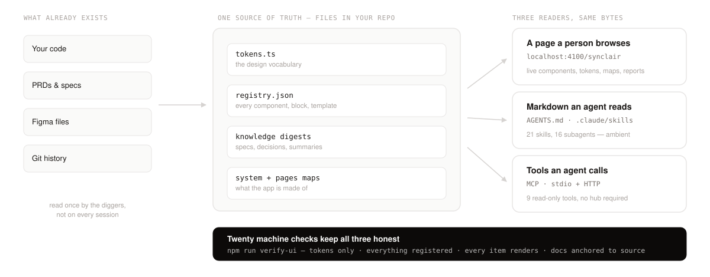
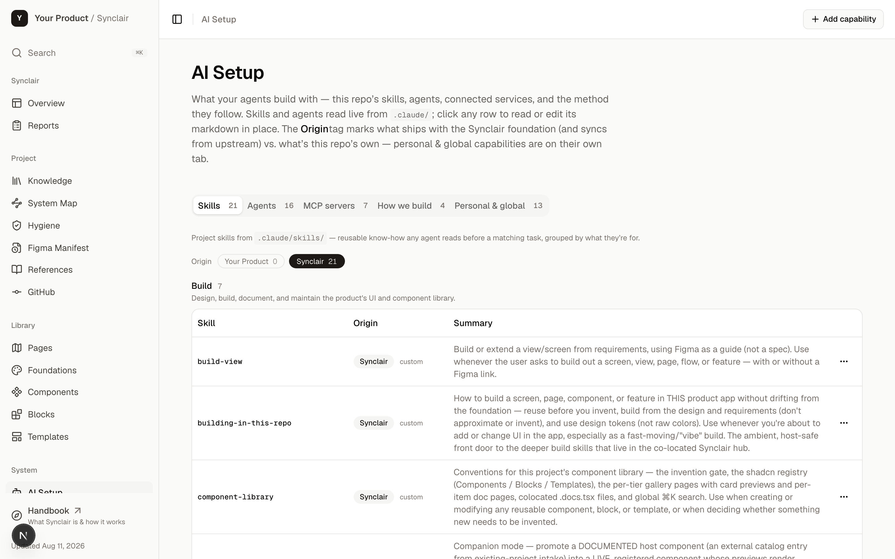
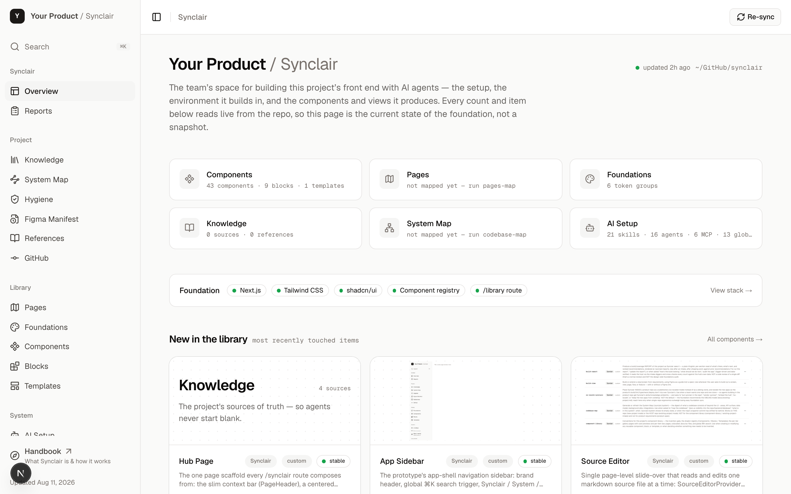
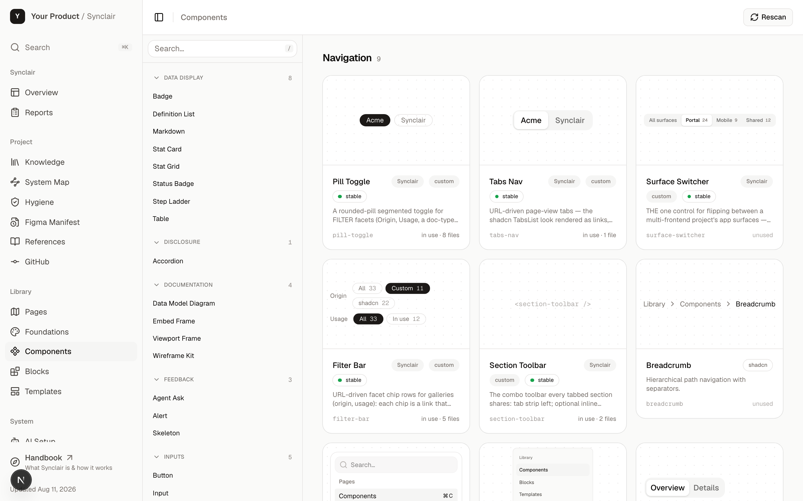
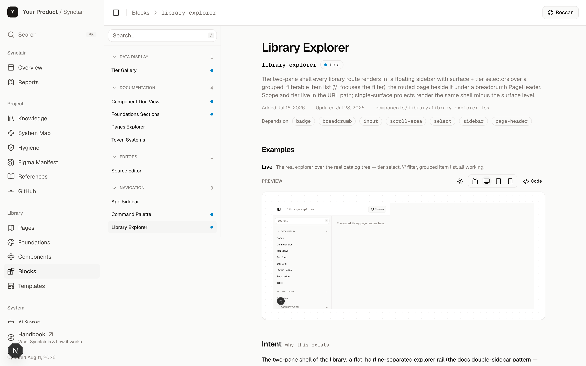
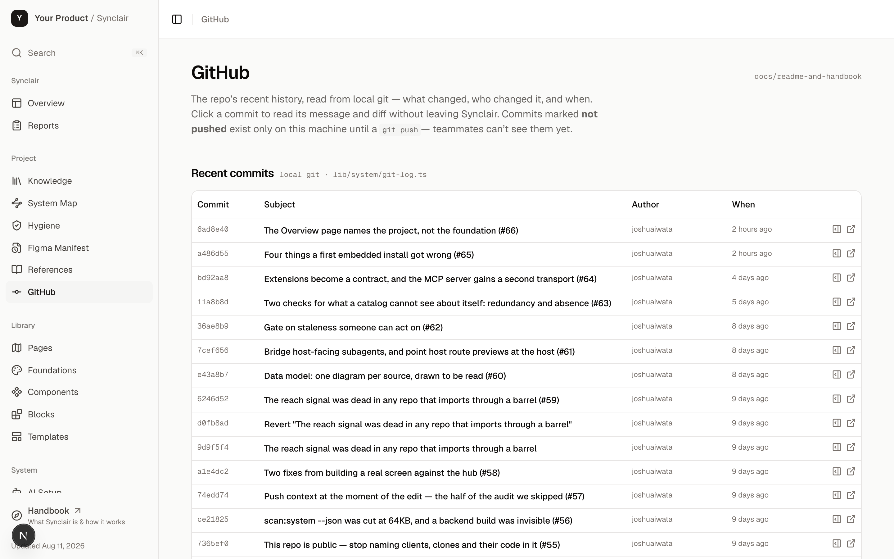

<div align="center">

# Synclair

<p align="center">
  <a href="https://www.npmjs.com/package/synclair"></a>
  <a href="https://github.com/joshuaiwata/synclair/actions/workflows/verify.yml"></a>
  <a href="LICENSE"></a>
  <a href="https://github.com/joshuaiwata/synclair/stargazers"></a>
</p>

<p align="center">
  <a href="https://synclair.dev"><strong>synclair.dev</strong></a> ·
  <a href="https://docs.synclair.dev"><strong>Handbook</strong></a> ·
  <a href="docs/foundation-model.md"><strong>The spec</strong></a> ·
  <a href="AGENTS.md"><strong>AGENTS.md</strong></a>
</p>

<p align="center"><sub>
  <a href="#why-building-with-agents-decays">The problem</a> ·
  <a href="#one-repo-three-fixes">The fixes</a> ·
  <a href="#your-agent-stops-starting-from-zero">For your agent</a> ·
  <a href="#the-nine-mcp-tools">MCP tools</a> ·
  <a href="#what-one-clone-actually-gives-you">What's in the hub</a> ·
  <a href="#the-library-documents-itself-as-you-build-it">The library</a> ·
  <a href="#a-doc-page-that-only-shows-code-doesnt-count">Guardrails</a> ·
  <a href="#point-your-agent-at-it">Quickstart</a> ·
  <a href="#adopt-it-onto-an-app-that-already-exists">Existing apps</a> ·
  <a href="#see-the-whole-app-not-just-its-parts">Maps &amp; reports</a> ·
  <a href="#how-it-compares">Comparison</a> ·
  <a href="#who-its-for">Who it's for</a> ·
  <a href="#what-synclair-doesnt-do">Limits</a>
</sub></p>

---

### Every agent session starts blank. Your repo already knows the answer — Synclair is where it gets written down.

<table align="center">
<tr>
<td align="center" width="250"><h2>21 + 16</h2></td>
<td align="center" width="250"><h2>21</h2></td>
<td align="center" width="250"><h2>9</h2></td>
</tr>
<tr>
<td align="center" valign="top"><sub><strong>skills and subagents ship in the<br />clone</strong> — intake, building views,<br />distilling specs, reviewing the result.<br />Plain markdown, any agent reads them</sub></td>
<td align="center" valign="top"><sub><strong>machine checks stand between<br />your agent and "done."</strong><br />Tokens only, everything registered,<br />every item actually renders,<br />every digest anchored to its source</sub></td>
<td align="center" valign="top"><sub><strong>MCP tools over the same data,</strong><br />on two transports — so an agent can<br />ask one narrow question instead of<br />reading a whole file. Zero dependencies</sub></td>
</tr>
</table>

<sub>Storage is git — no database, no service, nothing phoning home. The one measured claim we make
about the tools is <strong>~40% against equivalent file reads</strong>, and the
<a href="docs/agent-interface.md"><strong>method that produced it</strong></a> documents why an earlier
86–97% figure was wrong. Synclair is also <strong>opinionated</strong> — Next + Tailwind + shadcn,
tokens or nothing. <a href="#what-synclair-doesnt-do"><strong>What it doesn't do →</strong></a></sub>

<picture>
  <source media="(prefers-color-scheme: dark)" srcset=".github/assets/one-source-dark.svg" />
  
</picture>

</div>

---

## Why building with agents decays

Not because the agent is bad at writing code. Because three things nobody built a place for
keep going missing.

**01 · Agents reinvent.** Your agent needs a data table. Two already exist in the repo; it
finds neither, so now there are three — each with its own padding, its own empty state, and
its own idea of what blue means. Nobody approved a third table. Nobody was asked.

**02 · Context dies with the session.** You explained the approval flow on Monday. On
Thursday, a new session, you explain it again — and the PRD that actually answers it is a
40-page doc in Drive that nothing in the repo points to.

**03 · Humans lose the thread.** Four views shipped this week. The designer has seen one,
the PM is describing a flow that changed on Tuesday, and the only honest way to find out
what exists is to read the code. So nobody does, and the drift is discovered in a demo.

## One repo, three fixes

Every one of those is the same failure — *the answer already existed and nothing made it
reachable.* So Synclair writes each answer down **once**, in the repo, where it's read three
ways: **a page a person browses, ambient markdown an agent loads, and MCP tools an agent
calls.** Same bytes, so they can't drift apart.

| The problem | The fix | How it works |
|---|---|---|
| **01** Agents reinvent | **A library an agent has to check** | Every component registered at creation and rendered live, so *"do we already have this"* has an answer. Raw hex and stray px are lint errors, so a third blue can't ship even when nobody's looking |
| **02** Context dies with the session | **Knowledge that outlives the session** | The 40-page read happens **once**: specs, Figma and decisions get distilled into skills any agent loads on demand — and the same digests answer as **nine MCP tools**, so a narrow question costs a query instead of a file read |
| **03** Humans lose the thread | **A page anyone can look at** | Everything the agents produce renders as a hub — live components, a route map, plain-English reports — that a designer, PM or stakeholder browses without reading a line of code |

It runs as its own app on port 4100, in or beside your repo, and never becomes a dependency
of your product.

```bash
npx synclair new my-project
cd my-project && npm install && npm run dev   # hub at http://localhost:4100/synclair
```

---

## Your agent stops starting from zero

*Problem 02, up close.* An agent begins every session knowing nothing about your project,
so it either asks you or guesses — and it guesses more often than it asks.

Synclair doesn't run anything by itself; it turns the coding agent you already use into the
engine. You talk to the agent; Synclair supplies what it needs to act well: **skills**
(packaged know-how), **knowledge** (distilled specs, maps, catalogs), and **guardrails**
(checks that keep the output honest).



<sub>`/synclair/ai-setup` reads `.claude/` live, so the crew on the page is the crew on disk.
Every capability is tagged <strong>foundation</strong> (ships with Synclair, syncs from upstream) or
<strong>project</strong> (yours, never syncs). A fourth tab catalogs the <strong>MCP servers</strong> the project is
wired to and what each is for here — Figma, Notion, browser control — so the tooling is
documented next to the skills that use it.</sub>

**Claude Code gets the deepest integration** — skills auto-surface by description, and 16
subagents split the work: *diggers* do the context-heavy reading in their own windows (so
your main thread never loads a 40-page PRD), *reviewers* check the result before it's
called done. **Any other agent works too**: [`AGENTS.md`](AGENTS.md) is the
same playbook in plain markdown, and Cursor, Codex, Copilot, Gemini and Aider follow it by
reading it.

**The flywheel is the point.** Diggers explore first and seed the hub so it starts full
instead of blank. From then on, whatever you build documents itself into the shared surface
*as it's built* — nobody stops to write docs, and the next thing starts from everything
before it.

A concrete session:

> **You:** "Populate Synclair from this codebase."
> **Agent:** runs `existing-project-intake` — diggers survey the repo, harvest its docs,
> extract its design tokens, catalog every component. The hub fills up.
>
> **You:** "How's the build looking? What should we do next?"
> **Agent:** runs `build-report` — a data-verified read of what's there and a ranked list of
> recommendations, rendered at `/synclair/reports`.
>
> **You:** *(pick one)* "Do #2 — extract the table into the library."
> **Agent:** runs `component-library` — builds it on the tokens, registers it, writes its UX
> docs, and the checks verify it renders before it can be called done.

Full list of capabilities: **[docs.synclair.dev/agents-and-skills →](https://docs.synclair.dev/agents-and-skills)**

---

## The nine MCP tools

Ambient markdown is how an agent learns *how you work*. It's a poor way to ask *one narrow
question* — "what's the token for a warning background?" shouldn't cost a 4,368-token read
of `tokens.ts`. So the same data is also served as **nine task-shaped MCP tools**:

| Tool | Answers |
|---|---|
| `get_overview` | What this product is, how the clone is wired, what the hub knows — and how fresh it is |
| `search_library` | Components, blocks and templates — native **and** cataloged host items |
| `get_component` | The full record plus which pages compose it (batched) |
| `get_foundation` | The semantic tokens **and** the styling rules that govern them |
| `get_page` | The sitemap, or full records for specific routes (batched) |
| `get_system` | Areas, API surface, data model, jobs, integrations |
| `get_knowledge` | Sources of record and where each digest lives |
| `search_all` | One search across everything the hub knows — library, pages, system map, knowledge |
| `whats_new` | What changed recently, narrated in product language from real repo history |

Three properties are the point:

- **No hub required.** It reads JSON off disk — no Next, no port, no dev server. Agents
  stop needing the hub *running* to read the catalog.
- **No dependencies.** Raw JSON-RPC over stdio rather than the SDK, so a cloned foundation
  works in any clone with zero install.
- **Two transports, one registry.** stdio for agents working in a clone; HTTP for a
  teammate's client with no clone at all. Both import the same tool registry, so they can't
  answer differently. The HTTP route 404s until you configure tokens — a clone that never
  sets them never exposes one.

Registration is opt-in (`npm run mcp:install`) and deliberately **not** wired to
`postinstall`: writing a repo's own `.mcp.json` is fair game, but writing your global agent
config as an install side effect would be invisible and hard to undo.

**What the tools save, stated carefully:** ~40% against equivalent file reads across
comparable scenarios, versus a permanent +854-token tool surface. Not the 86–97% the first
version of our own harness reported — that number was wrong three ways (it counted skill
bodies as lookup cost, compared filtered queries against whole-file reads, and let blank
seed data produce fake wins). All three are now fixed and enforced in the measurement
script, which prints *"not comparable"* rather than a flattering percentage.

---

## What one clone actually gives you

Eleven surfaces, all under `/synclair`, all rendered from files in your repo. Your product
lives at `/` (or in its own repo entirely — see [companion mode](#adopt-it-onto-an-app-that-already-exists)).



<sub>The Overview counts every card live from the repo, so it's the current state of the
foundation, not a snapshot someone remembered to update.</sub>

| Surface | What it holds | Source of truth |
|---|---|---|
| **Foundations** | Design tokens — color, type, spacing, radius, motion — rendered live from the theme | `lib/system/tokens.ts` |
| **Components · Blocks · Templates** | The library: every registered item renders **live**, with UX docs (intent, anatomy, interactions, responsive) | `registry.json` + colocated `*.docs.tsx` |
| **Knowledge** | Sources of record (PRDs, specs, Figma, decks) + distilled digests and per-audience summaries | `lib/system/knowledge/sources.ts` |
| **System Map** | Areas, API surface, data model, jobs, integrations — what the codebase is beyond the UI | `data/system-map.json` |
| **Pages** | Every route the app serves, with a live preview and the components each one composes | `data/pages-map.json` |
| **Reports** | Plain-English state of the build + ranked next steps | `data/reports/` |
| **Hygiene** | Where the code steps outside its own design system — inline styles, raw colors, bypassed primitives | `data/host-hygiene.json` |
| **AI Setup** | The skills, diggers and MCP servers this repo builds with | `.claude/` (read live) |
| **References** | The project's research library — prior art, findings, recommendations | `lib/system/references.ts` |
| **Environment** | Stack, services, and whether your foundation is behind upstream | `data/mother.json` |
| **Settings** | Which sections this project shows, which extensions are on, who can change it | `data/extensions.json` |

**Not every project wants all ten.** Sections are toggleable per project from Settings, and
`EXTENSIONS` is a declared contract for adding your own — so a clone can be trimmed to what
a team actually uses instead of carrying surfaces it ignores.

**Storage is git, and that's a design decision, not a shortcut.** One source and two
renderings only holds if there's a single canonical copy — a file in git is that copy. It
also means a token change is a reviewable diff, agents need no API to read it, and
multiplayer is `git pull`.

Tour of every surface: **[docs.synclair.dev/the-hub →](https://docs.synclair.dev/the-hub)**

---

## The library documents itself as you build it

*Problem 01, up close.* Component docs are the first thing to be skipped and the last thing
to be caught up on, so the catalog is always a little bit fiction — which is exactly why the
next agent doesn't trust it and builds its own table.

Synclair inverts that: documenting isn't a follow-up task, it's part of registering the
thing. Every component, block and template lands in one gallery, each card rendering the
real thing — not a screenshot of it, not a code fence.



<sub>Grouped by what things are *for*, filterable, with usage counts read from the import
graph — <code>in use · 7 files</code> tells you what's load-bearing and what's a stray.</sub>

Open one and you get the documentation a design system actually needs: what it's for, its
anatomy, its interaction rules, its responsive behavior, its real API — beside a live
preview you can flip between viewports and themes.



<sub>Depth scales with tier: a component needs less than a block, a block less than a
template. Docs are commit-anchored to the source they describe, so drift gets flagged
instead of quietly accumulating.</sub>

The registry is **shadcn-format**, so your components stay installable with the stock
shadcn CLI — Synclair adds documentation and governance around your library without
locking it inside itself.

The conventions: **[docs.synclair.dev/component-library →](https://docs.synclair.dev/component-library)**

---

## A doc page that only shows code doesn't count

*The problem underneath all three.* Every convention above is the kind a team agrees to and
then quietly stops following at 5pm on a Thursday. A rule enforced by review is a rule
enforced sometimes, and an agent moving fast will find the gap before you do.

So none of it is left to discipline. `npm run verify-ui` has to pass before any UI work is
"done", and CI runs the same gate on every PR.

| Check | What it refuses to let through |
|---|---|
| `lint` | Raw hex and arbitrary px values. The theme is the only styling vocabulary — and hardcoded `/synclair` paths fail too |
| `check:registry` | A component that exists in the codebase but not in the registry. Unregistered means unfindable, which means it gets reinvented |
| `check:previews` | **A library item that doesn't actually render.** A doc page showing only a code snippet is a claim the browser can't back up |
| `check:tiering` · `check:recipes` | The two fictions a catalog can't see about itself: **redundancy** (three entries that are the same thing) and **absence** (a pattern used everywhere that nothing documents) |
| `check:ux-docs` | A stable block or template missing intent, interactions, states or responsive docs — or docs that drifted from the source commit |
| `check:freshness --strict` | Any generated digest whose source has moved since it was written. One report across every artifact, rather than each one growing its own staleness check |
| `check:contracts` | **A confident wrong answer.** "These 75 endpoints are unused" invites someone to delete a live one, so the seam that produces such claims is self-tested |
| `check:pages` · `resolve:pages` | A sitemap that no longer matches the routes on disk |
| `check:purity` | Seed content leaking into the portable foundation |
| `check:host` | A host-component catalog entry whose source has changed underneath it |
| `check:agent-bridge` | Skills and agents the hub can no longer read |
| `check:mcp --strict` | **An MCP server that was never registered.** The probe proves it runs and the contract check proves its tools return real content — neither asks whether any agent can actually reach it. A stale entry from an earlier clone resolves fine and serves someone else's catalog |
| `check:edges` · `check:anchors` · `check:rulings` · `check:augment` · `check:brief-feed` | **The checkers themselves.** Path normalisation and quiet-failure bugs don't announce themselves, so the risky seams carry self-tests |
| `typecheck` | The usual |

Note what that list is mostly made of: not "did you write the docs," but **"is this claim still true."** A catalog that confidently describes something that moved is worse than no catalog, because people act on it.

The error messages tell you the fix, and `eslint-disable` around them is not the fix. This
is the part that makes the fast path and the consistent path the same path — an agent
moving quickly doesn't get to choose between them.

---

## Point your agent at it

**1. Clone the foundation**

```bash
npx synclair new my-project
cd my-project && npm install
```

**2. Start the hub** — its own server, port 4100, never 3000.

```bash
npm run dev        # http://localhost:4100/synclair
```

**3. Register the MCP server** — optional, and the one piece of wiring there is. The
markdown works without it; this adds the [nine tools](#the-nine-mcp-tools).

```bash
npm run mcp:install    # resolves the right path from data/setup.json, merges into .mcp.json
```

<details><summary><b>Claude Code</b></summary>

`npm run mcp:install` writes the repo's `.mcp.json`, which Claude Code picks up on next
launch (it'll ask you to approve the server once). Or wire it by hand:

```bash
claude mcp add synclair -- node scripts/mcp-server.mjs
```

Skills need no wiring at all — `CLAUDE.md` imports [`AGENTS.md`](AGENTS.md) at session
start and the 21 skills auto-surface by description.

</details>

<details><summary><b>Cursor · Codex · Copilot · Gemini · Aider</b></summary>

Any MCP client can run the stdio server directly:

```json
{ "mcpServers": { "synclair": { "command": "node", "args": ["scripts/mcp-server.mjs"] } } }
```

For the ambient half, point the agent at [`AGENTS.md`](AGENTS.md) — same router, agent-neutral.
When a task matches a skill's *when*, it opens `.claude/skills/<name>/SKILL.md` and follows it.

</details>

<details><summary><b>A teammate with no clone</b></summary>

Point their client at the hosted hub's `/api/mcp` endpoint with a bearer token from
`SYNCLAIR_MCP_TOKENS`. Same nine tools — both transports import the same registry. With no
tokens configured the endpoint 404s, so a clone that never sets them never exposes one.

</details>

**4. Open your agent in the clone and say what you want.** No commands to learn; the skills
route on intent.

| Say this | What runs |
|---|---|
| *"Run me through setup"* | The interview + reseed flow — brand, identity, knowledge sources |
| *"Populate Synclair from the codebase"* | The intake — diggers survey, harvest, extract tokens, catalog components |
| *"Build the &lt;name&gt; view"* | Requirement-first building on the design system |
| *"How's the build looking?"* | The report, then act on its recommendations |

Full walkthrough: **[docs.synclair.dev/installation →](https://docs.synclair.dev/installation)**

---

## Adopt it onto an app that already exists

*The version of all three problems you've already got.* Most teams don't get to start
clean — the three tables already exist, the tokens are already scattered, and the last
person who knew why has left. But adopting anything usually means a migration nobody has
budget for.

So this one doesn't ask for one. Point Synclair at an app that already exists and it
becomes a **companion**: its own repo beside yours, its own server, reading your code
one-way and never adding a route, dependency or build step to it.

One command's worth of conversation turns an unfamiliar codebase into a browsable library,
a system map, a knowledge base and a hygiene report:

> **You:** "Populate Synclair from the codebase."

The diggers survey the repo, harvest its docs into the knowledge manifest, mine its real
design tokens out of the Tailwind config and CSS, and catalog its components — API derived
from the types, usage counts from the import graph, source hashes so `npm run check:host`
can tell you when an entry goes stale.



<sub>Repo activity is read from local git — no API token, no integration. Git is the shared
database, so recent history is just another surface.</sub>

Three topologies, one foundation ([`docs/setup-modes.md`](docs/setup-modes.md)):

| You have… | Do this | Guide |
|---|---|---|
| **Nothing yet** | `npx synclair new my-project` — the clone *is* the repo; your product grows at `/`, the hub at `/synclair` | [`docs/new-project.md`](docs/new-project.md) |
| **An existing app**, repos separate | `npx synclair new my-app-synclair` as a **sibling** — documents the host, touches nothing in it | [`docs/existing-project.md`](docs/existing-project.md) |
| **An existing repo**, one-repo team | Embed at `./synclair` via git subtree, so the whole team and their agents get it by cloning | `co-locate-synclair` skill |

---

## See the whole app, not just its parts

*Problem 03, up close.* A component library tells you what the pieces are. It can't tell
you that a route shipped on Tuesday, that the checkout flow now has a step nobody
mentioned, or that a third of the app never touches the design system at all.

These surfaces answer what was actually built out of the pieces:

- **Pages** — every route the app serves, with a live preview of each, the navigation edges
  between them, and the components, blocks and templates each one composes. Regenerated by
  the `pages-map` skill, kept honest by `check:pages`.
- **System Map** — the part with no UI at all: areas, API surface, data model, background
  jobs, integrations. What a new engineer (or agent) would otherwise spend a week
  reconstructing.
- **Hygiene** — where the code steps outside its own foundation. Inline styles, raw colors,
  arbitrary values, bypassed primitives, each with a file and a line.
- **Reports** — the plain-English read: what's there, what's next, ranked recommendations,
  every count cross-checked against the hub's own data rather than asserted.
- **Knowledge freshness** — probes each linked PRD, spec or deck for whether it moved since
  its digest was written, and queues the stale ones for re-distilling. Docs rot; this at
  least makes the rot visible.

---

## How it compares

Synclair sits between three familiar things and is none of them.

| | **Storybook** | **A docs site** | **Synclair** |
|---|---|---|---|
| Primary job | Build & test components in isolation | Publish written docs | Align humans + agents on the whole design system and its knowledge |
| Scope | Components | Whatever you write | Tokens, components, knowledge, system map, sitemap, hygiene, AI setup |
| Second audience | Developers | Readers | Developers **and AI agents** — machine-readable context |
| Relationship to your app | A dev dependency you import | A separate site you maintain | Not a dependency — a foundation in or beside your app |
| "Rendering" | The whole point | Screenshots you paste in | Live, *and enforced* — an item that can't render fails the build |
| Storage | Config + stories in your repo | A CMS or markdown | Git is the database; every fact is a versioned file |
| Knowledge | None | Prose someone remembered to write | First-class: PRDs/Figma/decisions distilled into agent-loadable skills |
| Who writes it | You | You | Your agent, as a side effect of building |

**Against agent-context tools** (repowise, CodeGraph, Serena and friends): different job,
and a genuinely complementary one.

| | **Agent-context tools** | **Synclair** |
|---|---|---|
| What gets indexed | The code that already exists | The decisions behind what gets written next |
| Typical output | Call graph, git archaeology, dead code, health scores | Tokens, component conventions, requirements, maps |
| Read or write | Helps an agent **read** your codebase well | Governs what an agent **writes** into it |
| How context reaches the agent | An MCP server, queried per task | **Both** — ambient markdown *and* an MCP server with nine tools |
| Human surface | A generated wiki | A live design system + knowledge hub |
| Enforcement | Advisory signals | Checks that fail the build |

The short test: if your agent keeps *rediscovering* your codebase, index it. If your agent
keeps *reinventing your button*, this is the one you want. Running both is reasonable —
they don't overlap.

The long version: **[docs.synclair.dev/vs-storybook →](https://docs.synclair.dev/vs-storybook)**

---

## Who it's for

| | Start here |
|---|---|
| **Teams building with agents** | You want velocity without a Frankenstein codebase. The guardrails make the fast path and the consistent path the same path. → `npx synclair new` |
| **Teams inheriting or auditing an app** | One intake turns an unfamiliar codebase into a library, system map and hygiene report — without touching the host repo. → [`docs/existing-project.md`](docs/existing-project.md) |
| **Agencies & prototypers** | You start projects constantly and want every one to begin with a working design system, doc system and agent crew. → [`docs/new-project.md`](docs/new-project.md) |
| **Designers** | A live style guide and component gallery that can't go stale, because it's rendered from the same tokens the app ships. → [Foundations](https://docs.synclair.dev/foundations) |
| **Stakeholders** | See what's being built — live components and plain-English reports — without reading code. → [Reports](https://docs.synclair.dev/reports) |

---

## What Synclair doesn't do

The honest list, so you can rule it out quickly:

- **It doesn't index or analyze your code the way a code-intelligence tool does.** No call
  graph, no defect prediction, no dead-code detection. It documents your design system and
  your product knowledge.
- **It has opinions about your stack.** The hub is Next + Tailwind + shadcn, and the token
  rules are lint-enforced. Live previews need something React-shaped; React Native is
  supported through react-native-web, other stacks get documented rather than rendered.
- **It ships no AI of its own.** Every intelligent thing here runs on the agent *you*
  already pay for. Without one, the hub is still a live style guide, component library and
  system map — but the flywheel doesn't spin.
- **Its MCP server is read-only.** Nine tools that answer questions about the catalog,
  tokens, pages and knowledge. Nothing writes through it — building still happens through
  your agent editing files, where the guardrails can see it.
- **It isn't hosted, and there's no dashboard for your org.** Each person runs it from the
  clone. That's what makes git the database and keeps your code on your machine.
- **The seed starts blank on purpose.** A fresh clone is a foundation, not a filled-in
  project; setup or intake is what populates it.
- **Nothing auto-updates.** Foundation improvements reach you only when you ask for them.

---

## Under the hood

[`docs/foundation-model.md`](docs/foundation-model.md) is the spec. The short version, three layers:

- **Brain** (portable) — token vocabulary, tier system, docs contract, search, knowledge
  layer. `lib/system/*`, `.claude/`. This is what syncs from upstream.
- **Seed** (yours, never syncs) — brand, identity, domain knowledge, project data. Blanked
  by `scripts/synclair-reset.sh`, filled per project, and `check:purity` keeps the two from
  bleeding into each other.
- **Adapter** (swappable) — how previews render and tokens export. The hub UI is always
  Next + shadcn; what it *governs* can be a web app or, via react-native-web, React Native.

---

## Staying current — updates are opt-in

Like shadcn, the source transfers to you: nothing phones home, nothing auto-updates.

```bash
npm run call-home     # opt-in: is my foundation behind, and what's incoming?
```

When you want the updates, the `synclair-sync` skill pulls them as a deliberate git merge.
Your seed never syncs, in either direction.

---

## FAQ

**Is Synclair part of my app?** No. Separate Next app, own server, port 4100. In companion
mode it never adds a route, dependency or build step to your product.

**Does my team need to run AI to benefit?** No — the hub is useful to a human with zero AI.
But the flywheel is agent-driven; see [what it doesn't do](#what-synclair-doesnt-do).

**Which agents work with it?** Claude Code deepest (skills auto-surface, digger subagents).
Anything that reads [`AGENTS.md`](AGENTS.md) follows the same playbook manually.

**Can I modify it?** It's your clone from the first commit — that's the model. Modify
anything; sync stays deliberate.

**Where is everything stored?** In git. If a change deserves a commit message, it's a file
in the repo.

**Monorepo?** Yes — embed it at `./synclair` with the `co-locate-synclair` skill, isolated
so the two apps' builds don't collide.

## License

[GPL-3.0-or-later](LICENSE) — free software; clones and derivatives stay free.

---

<div align="center">
<sub>One repo that is both the product's foundation and its documentation.<br />
Clone it, seed it, and every agent — and every teammate — starts oriented.</sub>
</div>
