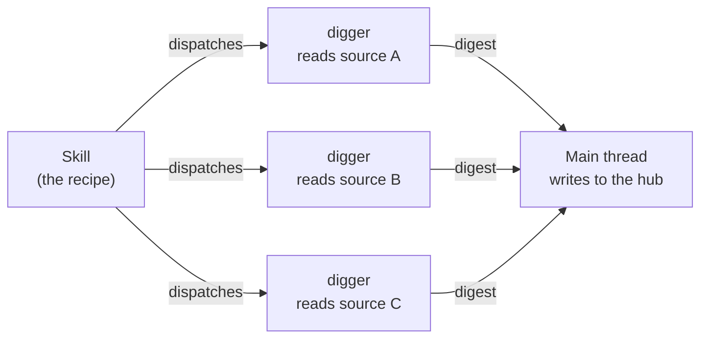

Synclair's "intelligence" isn't a model it ships. It's two simple building blocks that
your existing AI tool uses: **skills** (packaged know-how it loads on demand) and
**agents** (specialist sub-workers that do heavy reading in isolation). This page
explains what each is, how it works, and how they combine.

<CardGroup cols={2}>
  <Card title="Skills = the playbook" icon="book">
    Reusable, plain-markdown guides that tell an agent *how* to do a kind of task.
    Loaded into the current conversation only when relevant.
  </Card>
  <Card title="Agents = the workers" icon="robot">
    Narrow sub-agents ("diggers") that read a heavy source in their **own** context and
    hand back a tight answer — keeping the main conversation clean.
  </Card>
</CardGroup>

## Skills — reusable know-how, as plain markdown

A **skill** is a folder — `.claude/skills/<name>/` — with a `SKILL.md` inside. No
framework, no runtime; it's just structured markdown any agent can read.

```markdown SKILL.md
---
name: build-view
description: Build or extend a view/screen from requirements, using Figma as
  a guide. Use whenever asked to build a screen, page, flow, or feature.
category: build
layer: foundation
---

# build-view

The steps, conventions, and gotchas for building a view on this design system…
(and links to references/*.md for the deep detail)
```

Three parts do the work:

- **`description`** — the ***when*.** A one-line trigger that says exactly when this
  skill applies. This is the only part that's always loaded (see below).
- **The body** — the *how*: the method, conventions, and rules for the task.
- **`references/*.md`** *(optional)* — deep detail that loads only if the body points to it.

### Progressive disclosure — why a huge playbook stays cheap

Skills are loaded in three tiers, cheapest first:

<Steps>
  <Step title="Always loaded — the description (~15 words)">
    Every skill's one-line `description` sits in context all the time. That's the whole
    cost of a skill until it's needed.
  </Step>
  <Step title="Loaded on match — the body">
    When a task matches the *when*, the full `SKILL.md` body loads. Only then.
  </Step>
  <Step title="Loaded on demand — the references">
    Files the body points to (`references/*.md`) load only when the body actually reaches
    for them.
  </Step>
</Steps>

<Note>
The payoff: a 5,000-line knowledge base costs about **15 words** of context until the
moment it's relevant. That's what lets Synclair carry dozens of skills without drowning
any single conversation.
</Note>

### How a skill gets used

- **Claude Code** auto-surfaces skills by their `description` and invokes them by name —
  you don't open the file first.
- **Any other agent** (Cursor, Copilot, Codex, Gemini, Aider) reads the same `SKILL.md`
  when a task matches its *when* — the manual version of the same progressive disclosure.
- **A human** browses them on `/synclair/ai-setup` and can read any one's markdown.

That portability is why the project's router is `AGENTS.md`, not a Claude-only file —
**every agent reads the same map.**

## Agents — specialist readers with their own context

An **agent** (Synclair calls them *diggers*) is a sub-agent with its **own context
window**. You hand it one narrow job — *read this 40-page PRD*, *survey this codebase*,
*extract this Figma page* — and it reads the heavy source in a throwaway context and
returns **one tight answer.**

<Note>
The point is **context isolation.** The expensive 40-page read happens somewhere you
throw away; only the distilled paragraph comes back to your main conversation. Ten
narrow diggers also beat one know-it-all agent — each returns a sharper answer.
</Note>

Diggers that ship include `codebase-surveyor`, `system-mapper`, `knowledge-harvester`,
`token-archaeologist`, `component-cataloger` (the existing-app intake crew),
`prd-retriever`, `figma-frame-reader`, and reviewers like `doc-quality-reviewer`.

## How skills and agents work together

This is the part that makes Synclair more than a folder of docs. **A skill is the
recipe; diggers are the prep cooks it sends off.** A skill describes a whole task, and
where that task needs heavy reading, it dispatches diggers — each reads one source in
isolation and returns a digest — and then the main thread acts on those digests.



**Worked example — populating the hub from an existing app.** The
`existing-project-intake` skill defines a five-phase intake and dispatches a digger for
each phase:

| Phase | Digger | Reads → returns |
|---|---|---|
| Orient | `codebase-surveyor` | the repo → a stack + structure digest |
| Knowledge | `knowledge-harvester` | READMEs, docs, ADRs → proposed knowledge sources |
| Tokens | `token-archaeologist` | the styling source → a proposed token seed |
| Components | `component-cataloger` | component source → ready-to-write catalog entries |
| Architecture | `system-mapper` | the whole repo → the system map |

Each digger reads the host app in its **own** context and returns proposals; the **main
thread writes them into the hub** (the catalog, the tokens, the knowledge manifest, the
system map). One skill, five specialist reads, none of which clog the main conversation.

<Note>
**The contract:** diggers **read and propose**; only the main thread **writes** to the
repo. Skills orchestrate; agents fetch; the main thread decides and commits.
</Note>

### Skill or agent — which is which?

<CardGroup cols={2}>
  <Card title="Reach for a skill when…" icon="book">
    the guidance should shape what the main agent does **inline** — a method, a
    convention, a checklist it follows in the current context.
  </Card>
  <Card title="Reach for an agent when…" icon="robot">
    a task needs a **heavy read** whose bulk you don't want in the main context — send a
    digger and get back just the distilled answer.
  </Card>
</CardGroup>

The one-question test at creation time: **does it need its own context window?** If yes,
it's an agent; if no, it's a skill.

## How the set is organized

Every skill and agent carries two classifiers, surfaced on `/synclair/ai-setup`:

- **`category`** — `build` · `knowledge` · `intake` · `foundation` · `tooling` — groups them.
- **`layer`** — `foundation` (ships with Synclair, syncs from upstream) vs. `project`
  (this repo's own, never syncs) — drives the "Origin" badge.

## The gate that keeps the set solid

The set doesn't stay clean by a size limit — it stays clean by a **gate at creation.**
Before adding a new skill or agent, you have to (1) prove no existing capability covers
it — extend or distill into one instead, (2) pick skill-vs-agent by the context-window
test above, and (3) declare its `layer` + `category`. That gate lives in the `synclair`
skill.

## The flywheel — capabilities get smarter

When a digger surfaces something durable, it **writes the durable part back** into the
relevant skill. So the first read of an area is expensive, and every read after is a
cheap one-line load. Over time the distilled brain converges on exactly what a builder
routinely needs — and raw sources get consulted only for genuinely new detail.

## The ones worth knowing first

| When you're… | Reach for |
|---|---|
| Asking "what is this project / give me an overview" | **`project-identity`** |
| Building a view or screen | **`build-view`** |
| Creating or changing a component | **`component-library`** |
| Populating the hub from an existing codebase | **`existing-project-intake`** |
| Mapping the backend/architecture | **`codebase-map`** → `/synclair/system` |
| Mapping the pages/routes | **`pages-map`** → `/synclair/pages` |
| Maintaining Synclair itself | **`synclair`** |
| Pulling foundation updates | **`synclair-sync`** |

The full set lives in `.claude/skills/` and `.claude/agents/`, and is browsable on
**`/synclair/ai-setup`** — every capability, classified, with an Origin badge, one click
from its markdown.

<Card title="Next: can I modify all this?" icon="wrench" href="/customizing">
  What's safe to change, what syncs from upstream, and what's yours forever.
</Card>
